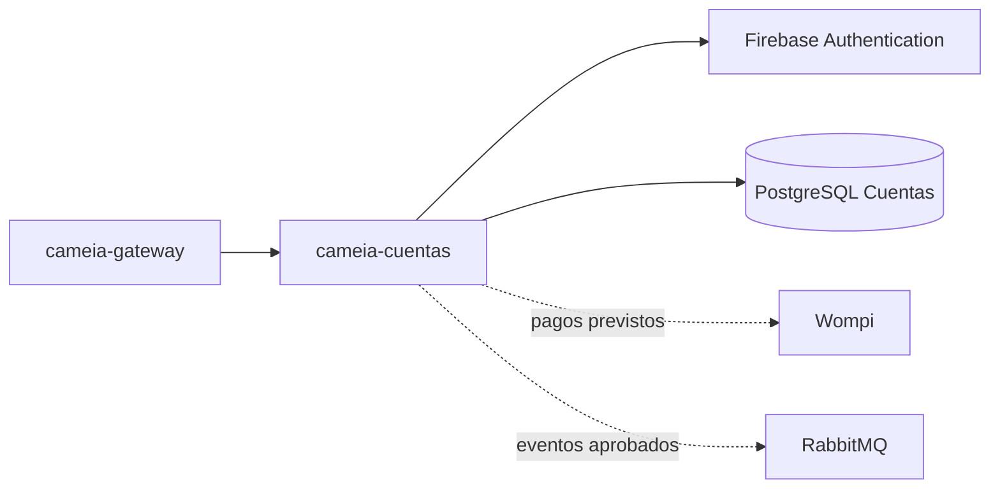

# cameia-cuentas

Microservicio de Cuentas de CAMEIA. Gestiona la cuenta local, planes, suscripción, pagos y entitlements sin custodiar contraseñas.

## Responsabilidades


- Mantener el estado local de la cuenta asociado a `firebaseUid`.
- Integrarse con Firebase sin almacenar contraseñas.
- Gestionar planes, suscripciones y transacciones cuando entren en alcance.
- Publicar cambios de plan/cuenta mediante contratos aprobados.
- Mantener su propia persistencia sin claves foráneas hacia otros contextos.


No registra el consumo detallado de IA ni implementa perfiles o entrevistas.


## Contexto arquitectónico




## Tecnología prevista

| Elemento | Línea base |
|---|---|
| Lenguaje | Java 21 |
| Framework | Spring Boot 4.1.1 |
| Build | Maven; wrapper pendiente de confirmar |
| Persistencia | PostgreSQL 16, base/rol propios |
| Integraciones | Firebase Admin, Wompi y RabbitMQ según alcance |
| Ejecución objetivo | Contenedor OCI en Cloud Run |


## Contratos y datos

- Identificador compartido entre contextos: `firebaseUid`.
- Credenciales y contraseñas permanecen en Firebase.
- Suscripciones, pagos y eventos deben ser idempotentes.
- Los nombres, esquemas y bindings de eventos se versionarán cuando sean aprobados.


## Ejecución local

```text
Instalación: pendiente de confirmar en CM-103
Pruebas: pendiente de confirmar en CM-103
Build: pendiente de confirmar en CM-103
Inicio: pendiente de confirmar en CM-103
Health check: pendiente de confirmar en CM-103
```


## Configuración y seguridad

- No guardar credenciales Firebase/Wompi, secretos ni `.env` en Git.
- Validar firma e idempotencia de webhooks cuando entren en alcance.
- No registrar tokens o información de pago sensible.
- Usar una base y un rol independientes de los demás microservicios.


## Calidad esperada

- Pruebas de registro, estados de cuenta, autenticación delegada y autorización.
- Pruebas negativas para tokens inválidos y acceso cruzado.
- Pruebas de idempotencia para pagos/eventos cuando apliquen.
- CI con build, pruebas y seguridad después de confirmar comandos reales.


## Contribución

- `main` es estable y solo recibe promociones `develop → main` mediante Merge commit.
- `develop` integra ramas `<tipo>/CM-NNN-<descripcion-kebab-case>` mediante Squash.
- Todo cambio ordinario entra mediante PR y revisión distinta del autor.

Tipos admitidos: `feat`, `fix`, `test`, `docs`, `refactor`, `perf`, `build`, `ci` y `chore`.


