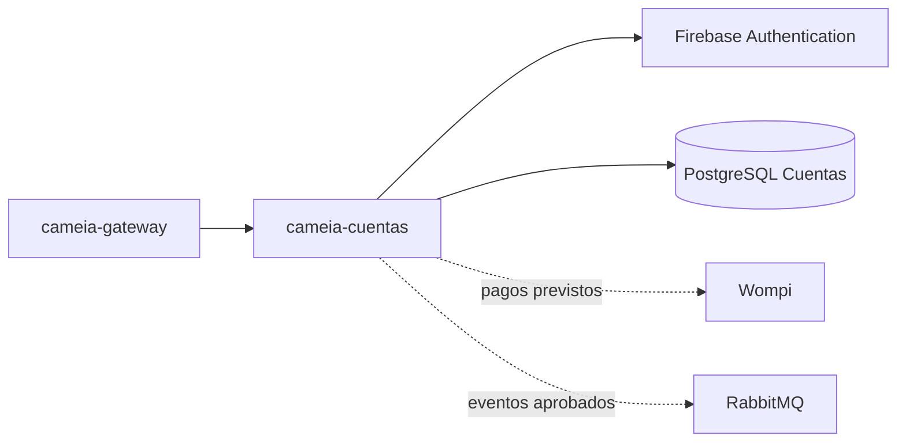

# cameia-cuentas

Microservicio de Cuentas de CAMEIA. Gestiona la cuenta local, planes, suscripción, pagos y entitlements sin custodiar contraseñas.

## Responsabilidades


- Mantener el estado local de la cuenta asociado a `firebaseUid`.
- Integrarse con Firebase sin almacenar contraseñas.
- Gestionar planes, suscripciones y transacciones cuando entren en alcance.
- Publicar cambios de plan/cuenta mediante contratos aprobados.
- Mantener su propia persistencia sin claves foráneas hacia otros contextos.


No registra el consumo detallado de IA ni implementa perfiles o entrevistas.


## Contexto arquitectónico




## Tecnología prevista

| Elemento | Línea base |
|---|---|
| Lenguaje | Java 21 |
| Framework | Spring Boot 4.1.1 |
| Build | Maven Wrapper 3.9.16 |
| Persistencia | PostgreSQL 16, base/rol propios |
| Integraciones | Firebase Admin, Wompi y RabbitMQ según alcance |
| Ejecución objetivo | Contenedor OCI en Cloud Run |


## Contratos y datos

- Identificador compartido entre contextos: `firebaseUid`.
- Credenciales y contraseñas permanecen en Firebase.
- Suscripciones, pagos y eventos deben ser idempotentes.
- Los nombres, esquemas y bindings de eventos se versionarán cuando sean aprobados.


## Ejecución local

Copie `.env.example` a `.env` y defina al menos `DB_PASSWORD`.

### Con Docker (aplicación y base de datos)

```powershell
docker compose up --build -d   # levanta cuentas + PostgreSQL 16
docker compose ps              # el servicio cuentas debe quedar en estado healthy
docker compose down            # detener; agregue -v para borrar los datos
```

La base de datos se publica en el puerto `DB_PORT_HOST` (5433 por defecto) para no
chocar con un PostgreSQL instalado localmente en el 5432. Dentro de la red de Compose
la aplicación sigue conectándose a `db:5432`, así que cambiar esa variable no afecta
la configuración de la aplicación.

### Sin Docker

Requiere un PostgreSQL 16 accesible en `DB_HOST:DB_PORT`.

```powershell
./mvnw.cmd test            # pruebas
./mvnw.cmd clean package   # build
./mvnw.cmd spring-boot:run # inicio
```

### Verificación

| Recurso | URL |
|---|---|
| Health check | `http://localhost:8081/api/v1/users/health` → `{"status":"UP"}` |
| Documento OpenAPI | `http://localhost:8081/v3/api-docs` |
| Referencia navegable (Swagger UI) | `http://localhost:8081/swagger-ui.html` |

La documentación solo se publica donde `API_DOCUMENTATION_ENABLED` valga `true`. La
variable viene en `.env.example`, así que basta copiarla a `.env`; `docker compose` la
pasa al contenedor con `true` por defecto. El perfil `prod` la deja apagada de forma
rígida, así que en producción tanto Swagger UI como `/v3/api-docs` responden `404`
aunque la variable diga lo contrario.
Ver [specs/CM-103-DocumentacionApi/spec.md](specs/CM-103-DocumentacionApi/spec.md).


## Configuración y seguridad

- No guardar credenciales Firebase/Wompi, secretos ni `.env` en Git.
- No encender `API_DOCUMENTATION_ENABLED` en entornos productivos: expone el contrato completo de la API.
- Validar firma e idempotencia de webhooks cuando entren en alcance.
- No registrar tokens o información de pago sensible.
- Usar una base y un rol independientes de los demás microservicios.


## Calidad esperada

- Pruebas de registro, estados de cuenta, autenticación delegada y autorización.
- Pruebas negativas para tokens inválidos y acceso cruzado.
- Pruebas de idempotencia para pagos/eventos cuando apliquen.
- CI con build, pruebas y seguridad después de confirmar comandos reales.


## Contribución

- `main` es estable y solo recibe promociones `develop → main` mediante Merge commit.
- `develop` integra ramas `<tipo>/CM-NNN-<descripcion-kebab-case>` mediante Squash.
- Todo cambio ordinario entra mediante PR y revisión distinta del autor.

Tipos admitidos: `feat`, `fix`, `test`, `docs`, `refactor`, `perf`, `build`, `ci` y `chore`.


