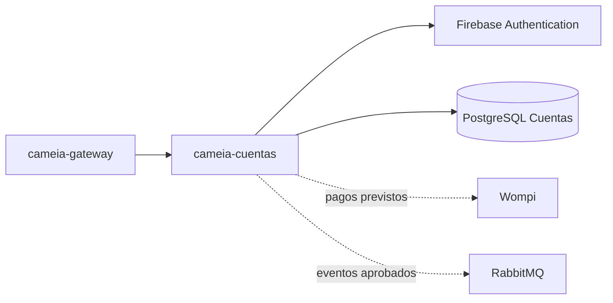

# cameia-cuentas

Microservicio de Cuentas de CAMEIA. Gestiona la cuenta local, planes, suscripción, pagos y entitlements sin custodiar contraseñas.

## Responsabilidades


- Mantener el estado local de la cuenta asociado a `firebaseUid`.
- Integrarse con Firebase sin almacenar contraseñas.
- Gestionar planes, suscripciones y transacciones cuando entren en alcance.
- Publicar cambios de plan/cuenta mediante contratos aprobados.
- Mantener su propia persistencia sin claves foráneas hacia otros contextos.


No registra el consumo detallado de IA ni implementa perfiles o entrevistas.


## Contexto arquitectónico


```mermaid
flowchart LR
    G[cameia-gateway] --> C[cameia-cuentas]
    C --> F[Firebase Authentication]
    C --> DB[(PostgreSQL Cuentas)]
    C -. pagos previstos .-> W[Wompi]
    C -. eventos aprobados .-> R[RabbitMQ]
```


## Tecnología prevista

| Elemento | Línea base |
|---|---|
| Lenguaje | Java 21 |
| Framework | Spring Boot 4.1.1 |
| Build | Maven Wrapper 3.9.16 |
| Persistencia | PostgreSQL 16, base/rol propios |
| Integraciones | Firebase Admin, Wompi y RabbitMQ según alcance |
| Ejecución objetivo | Contenedor OCI en Cloud Run |


## Contratos y datos

- Identificador compartido entre contextos: `firebaseUid`.
- Credenciales y contraseñas permanecen en Firebase.
- Suscripciones, pagos y eventos deben ser idempotentes.
- Los nombres, esquemas y bindings de eventos se versionarán cuando sean aprobados.


## Ejecución local

Copie `.env.example` a `.env` y defina `DB_PASSWORD`. Por defecto la aplicación usa el
**emulador de Firebase Auth** (`FIREBASE_PROJECT_ID=demo-cameia` y
`FIREBASE_AUTH_EMULATOR_HOST=cameia-firebase-emulator:9099`, que ya vienen en
`.env.example`): no necesita llave de cuenta de servicio y sus usuarios solo existen en su
máquina. El emulador es un servicio aparte, compartido con los demás servicios, que se
levanta desde el `docker-compose.yml` de `cameia-gateway` en la misma red `cameia-net`. Con
`FIREBASE_AUTH_EMULATOR_HOST` definida, la aplicación acepta tokens **sin firma**, por eso se
niega a arrancar si esa variable aparece en un despliegue (Cloud Run o perfil `prod`), aunque
esté vacía.

Para usar un proyecto **real** de Firebase, comente esa variable, defina
`FIREBASE_PROJECT_ID` con el ID real y `FIREBASE_KEY_PATH` con la ruta al JSON de la cuenta
de servicio, que no está en el repositorio: pídaselo a quien administra el proyecto. Sin
emulador ni credenciales la aplicación no arranca, porque no podría completar ningún
registro; para levantarla de todos modos, por ejemplo solo para revisar la documentación de
la API, use `FIREBASE_ENABLED=false`.

### Con Docker (aplicación y base de datos)

```powershell
docker compose up --build -d   # levanta cuentas + PostgreSQL 16
docker compose ps              # el servicio cuentas debe quedar en estado healthy
docker compose down            # detener; agregue -v para borrar los datos
```

La base de datos se publica en el puerto `DB_PORT_HOST` (5433 por defecto) para no
chocar con un PostgreSQL instalado localmente en el 5432. Dentro de la red de Compose
la aplicación sigue conectándose a `db:5432`, así que cambiar esa variable no afecta
la configuración de la aplicación.

### Reiniciar, actualizar y empezar de cero

Las cuentas viven en el volumen `cuentas-db-data`. Detener, reiniciar o recrear los
contenedores (`docker compose down`, `docker compose up --build -d`) las conserva. Al
arrancar, Flyway aplica solo las migraciones nuevas, una vez cada una, y deja las que ya
estaban (`Schema "microcuentas" is up to date` en el log). Las migraciones del registro
solo agregan o relajan restricciones: ninguna cambia las cuentas que ya existen. Si una
migración no se puede aplicar, la aplicación no arranca y el log dice cuál y por qué.

Cada usuario existe en **dos lugares**: su credencial en el emulador de Firebase Auth (volumen
`firebase-emulator-data` de `cameia-gateway`) y su cuenta en esta base. Si se borra uno y no el
otro, quedan desalineados:

| Qué se borró | Qué se ve | Por qué |
|---|---|---|
| Solo la base (`docker compose down -v` aquí) | Registrar ese correo responde 409 `EMAIL_ALREADY_REGISTERED`; iniciar sesión funciona, pero activar la cuenta responde 404 `ACCOUNT_NOT_FOUND` | La credencial sigue en el emulador y la cuenta ya no existe |
| Solo el emulador (`docker compose down -v` en `cameia-gateway`, o un apagado brusco como `docker kill`, que no alcanza a guardar sus usuarios) | Iniciar sesión falla con un usuario que la base sí tiene, y ese correo se puede volver a registrar | La cuenta sigue aquí y la credencial ya no existe |

Para empezar de cero, se borran los dos a la vez:

```powershell
docker compose down -v                                    # aquí: base de Cuentas
curl.exe -X DELETE http://localhost:9099/emulator/v1/projects/demo-cameia/accounts   # usuarios del emulador
```

El segundo comando vacía el emulador sin apagarlo; con `docker compose down -v` en
`cameia-gateway` también se borra lo guardado, junto con los demás volúmenes de ese
proyecto.

### Sin Docker

Requiere un PostgreSQL 16 accesible en `DB_HOST:DB_PORT`.

```powershell
./mvnw.cmd clean verify    # build, pruebas y cobertura (target/site/jacoco/index.html)
./mvnw.cmd spring-boot:run # inicio
```

### Verificación

| Recurso | URL |
|---|---|
| Health check | `http://localhost:8081/api/v1/users/health` → `{"status":"UP"}` |
| Documento OpenAPI | `http://localhost:8081/v3/api-docs` |
| Referencia navegable (Swagger UI) | `http://localhost:8081/swagger-ui.html` |

La documentación solo se publica donde `API_DOCUMENTATION_ENABLED` valga `true`. La
variable viene en `.env.example`, así que basta copiarla a `.env`; `docker compose` la
pasa al contenedor con `true` por defecto. El perfil `prod` la deja apagada de forma
rígida, así que en producción tanto Swagger UI como `/v3/api-docs` responden `404`
aunque la variable diga lo contrario.
Ver [specs/CM-103-DocumentacionApi/spec.md](specs/CM-103-DocumentacionApi/spec.md).


## Configuración y seguridad

- No guardar credenciales Firebase/Wompi, secretos ni `.env` en Git.
- No encender `API_DOCUMENTATION_ENABLED` en entornos productivos: expone el contrato completo de la API.
- Validar firma e idempotencia de webhooks cuando entren en alcance.
- No registrar tokens o información de pago sensible.
- Usar una base y un rol independientes de los demás microservicios.


## Calidad esperada

- Pruebas de registro, estados de cuenta, autenticación delegada y autorización.
- Pruebas negativas para tokens inválidos y acceso cruzado.
- Pruebas de idempotencia para pagos/eventos cuando apliquen.
- CI con build, pruebas y seguridad después de confirmar comandos reales.


## Contribución

Rama, commit, tipos, título de PR, revisión y merge: rige [CONTRIBUTING.md](CONTRIBUTING.md).
