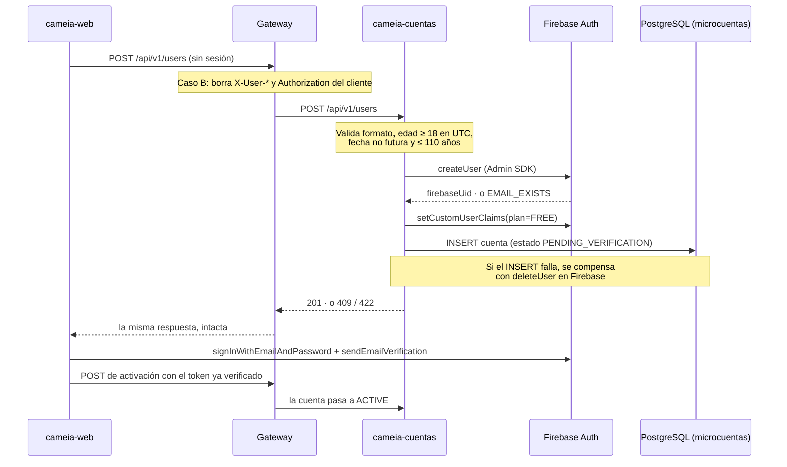

# Spec — CM-14-RegistroUsuario: lo que Cuentas necesita para registrar un usuario

- **HU asociada:** CM-14 — Registro de usuario
- **Sprint:** 1
- **Fecha:** 17/09/2026
- **Estado:** `Revisada` — clarificaciones cerradas el 17/09/2026; con [plan.md](plan.md) y [tasks.md](tasks.md) escritos
- **Rama:** `CM-14-RegistroUsuario`
- **Alcance:** **solo cameia-cuentas**. El Gateway y el frontend se citan para explicar qué llega y qué se espera de vuelta, no para especificar su trabajo.

> **AVISO: EL PLAN FREE DE ESTA SPEC NO RESPALDA NINGUN DERECHO NI CUOTA. SE ESCRIBE EL CUSTOM
> CLAIM `plan=FREE` EN FIREBASE, PERO NO EXISTE SUSCRIPCION, TARIFA NI CARACTERISTICA QUE LO
> SUSTENTE: LAS SEMILLAS COMERCIALES SIGUEN PENDIENTES Y QUEDAN FUERA DEL ALCANCE DE CM-14 POR
> TIEMPO DE SPRINT. NINGUN MICROSERVICIO DEBE INTERPRETAR ESE CLAIM COMO UN LIMITE VIGENTE
> HASTA QUE LA SPEC DE PLANES LO RESPALDE.**

- **Fuentes:**
  `criterios_de_aceptacion.md` (CA-1.1.1 a CA-1.1.3),
  `30082026_v1_DDL_MicroCuentas.sql` v1.0 del 30/08/2026,
  `cameia-gateway/specs/CM-14-Registro-usuario/spec.md` (C-1, C-5, C-6, C-10 y `REQ-REG-05` a `REQ-REG-10`),
  campos del prototipo PRT-01.01 entregados por Juan Vela el 17/09/2026,
  `CLAUDE.md` (límites de entrada, reglas de seguridad, capas DDD) y `docs/constitution.md`.

---

## 1. Contexto

### 1.1 Lo que pide la HU

Un invitado se registra con sus datos personales, su correo y una contraseña. Cuentas valida los
datos, crea la credencial en Firebase Auth, guarda la cuenta en PostgreSQL y le asigna el Plan
Gratis. La contraseña nunca se almacena ni se registra aquí: vive solo en Firebase.

El registro lo ejecuta **Cuentas** y no el Gateway ni el frontend, porque Cuentas es el único
escritor de los custom claims del plan y el dueño de la tabla `cuenta` (decisión C-1 del Gateway,
15/09/2026).

### 1.2 El flujo



### 1.3 Qué le toca a Cuentas y qué no

| Le toca a Cuentas | No le toca a Cuentas |
|---|---|
| Validar formato, edad, fecha de nacimiento y datos personales | Validar el ID Token: el registro es Caso B y llega sin sesión |
| Crear la credencial en Firebase Auth con el Admin SDK | Enviar el correo de verificación: lo dispara el frontend contra Firebase (C-6) |
| Escribir el custom claim `plan=FREE` | Recuperación de contraseña: navegador contra Firebase, sin pasar por la plataforma |
| Guardar la cuenta en `microcuentas.cuenta` | Guardar la contraseña o el correo: ambos son de Firebase |
| Compensar en Firebase si falla PostgreSQL | Rate limit: se aplica en GCP, delante del Gateway (C-4) |
| Devolver errores que el modal pueda mostrar tal cual | El modal PRT-01.01 y sus textos |
| Activar la cuenta cuando el correo queda verificado | Crear la suscripción FREE y sus semillas comerciales |

---

## 2. Decisiones adoptadas

Resueltas con Juan Vela el 17/09/2026. Cada una es la base de al menos un requisito de §3.

| # | Tema | Decisión |
|---|---|---|
| CU-1 | Estado inicial de la cuenta | La cuenta **no nace `ACTIVE`**. Nace `PENDING_VERIFICATION`, un estado nuevo, y solo pasa a `ACTIVE` cuando el correo queda verificado. El DDL admite hoy únicamente `ACTIVE`, `DISABLED` y `ANONYMIZED`, y su trigger `trg_cuenta_validar_insert` exige nacer `ACTIVE`: el DDL **no es fuente de verdad absoluta** y se corrige. `DISABLED` conserva su significado, que es una cuenta bloqueada, por ejemplo por impago |
| CU-2 | Quién activa la cuenta | Un **endpoint propio de Cuentas**, de Caso A: exige un ID Token cuyo claim `email_verified` sea `true`. La ruta es `POST /api/v1/users/me/verification`. Lo que el Gateway debe tener en cuenta está en [CONTRATO-GATEWAY-CM-14.md](../../CONTRATO-GATEWAY-CM-14.md); su coordinación la asume Juan Vela |
| CU-3 | Plan Gratis | El registro escribe el custom claim `plan=FREE` en Firebase. **No** se crea suscripción, tarifa ni fila en `sincronizacion_claim_firebase`: eso exige semillas comerciales aún no decididas y va en su propia spec. **El claim no respalda ningún derecho ni cuota**, tal como advierte el aviso del encabezado |
| CU-4 | Campos y obligatoriedad | Obligatorios: nombres, apellidos, fecha de nacimiento, correo y contraseña. Opcionales: celular y pronombres. El celular llega en **E.164** (`+573001234567`) y Cuentas lo rechaza si no lo está; no lo normaliza ni asume país |
| CU-5 | Formato de error | **Problem Details, RFC 7807** (`application/problem+json`), con una lista de errores por campo. Esto cierra la pregunta abierta de contrato de respuesta que estaba en `CLAUDE.md`. La versión de la API va en la ruta, `/api/v1`, como ya la declara el Gateway |
| CU-6 | Fallo parcial Firebase/PostgreSQL | Si Firebase crea el usuario y PostgreSQL falla, Cuentas **compensa con `deleteUser`** y responde `500`. Si la compensación también falla, registra el `firebaseUid` para conciliación manual. Así el correo queda libre para reintentar |
| CU-7 | Esquema y migraciones | **Flyway** dentro de esta HU, con `ddl-auto=validate` en todos los perfiles, incluido desarrollo: se prueba contra el mismo esquema que se despliega. `V1` contiene **solo lo que el registro necesita**: el esquema `microcuentas` y la tabla `cuenta`. Sin `pgcrypto` (los UUID los genera la aplicación y el HMAC pertenece a la anonimización), sin `btree_gist` (sirve a las suscripciones, que no entran aquí) y sin triggers |
| CU-8 | Triggers del DDL frente a DDD | Las reglas de negocio viven en `domain` con pruebas propias, no en funciones plpgsql. En la base quedan únicamente las restricciones que protegen la integridad aunque el código falle: unicidad de `firebase_uid`, lista de estados válidos, formato E.164 y nombres no vacíos |
| CU-9 | Acceso a Firebase | El dominio define un **puerto** propio y la infraestructura lo implementa con el Admin SDK. Las pruebas usan una implementación falsa y corren **sin credenciales** |
| CU-10 | Seguridad y contraseñas | Todo lo relativo a seguridad de esta HU se rige por **OWASP**: política de contraseñas según ASVS (mínimo 12 caracteres, hasta 64 admitidos, sin reglas de composición obligatorias y sin truncar), sin exponer detalle interno en los errores y sin registrar credenciales. La política la valida el dominio, porque Firebase por sí solo exige apenas seis caracteres |

---

## 3. Requisitos funcionales — notación EARS

Numeración propia: `REQ-CU-NN`.

### 3.1 Registro

#### REQ-CU-01 — Contrato de entrada

```
Cuando llega una solicitud POST a /api/v1/users con un cuerpo JSON válido,
el sistema debe registrar la cuenta sin exigir los encabezados X-User-*.
```

```
El sistema debe aceptar los campos firstName, lastName, birthDate, email y password
como obligatorios, y phoneNumber y pronouns como opcionales.
```

```
El sistema debe interpretar birthDate en el formato DD/MM/YYYY.
```

> El registro es el único endpoint de negocio exento del contrato de entrada del Gateway, porque el
> usuario todavía no existe y no hay identidad que propagar. Es una excepción documentada a
> `CLAUDE.md`, igual que `/health`.

#### REQ-CU-02 — Creación en Firebase

```
Cuando los datos del registro son válidos,
el sistema debe crear la credencial en Firebase Auth con el correo y la contraseña recibidos.
```

```
El sistema nunca debe almacenar la contraseña, ni en la base de datos ni en el log.
```

#### REQ-CU-03 — Plan Gratis

```
Cuando la credencial queda creada en Firebase Auth,
el sistema debe escribir el custom claim plan con el valor FREE para ese usuario.
```

#### REQ-CU-04 — Persistencia de la cuenta

```
Cuando el custom claim queda escrito,
el sistema debe guardar en microcuentas.cuenta una fila con el firebase_uid, el nombre,
el apellido, la fecha de nacimiento y, si llegaron, el teléfono y los pronombres.
```

```
El sistema debe crear toda cuenta nueva con estado PENDING_VERIFICATION.
```

```
El sistema no debe guardar el correo ni la contraseña en microcuentas.cuenta.
```

#### REQ-CU-05 — Respuesta del registro exitoso

```
Cuando el registro termina correctamente,
el sistema debe responder 201 Created con el identificador de la cuenta,
el firebaseUid, el estado PENDING_VERIFICATION y el plan FREE.
```

#### REQ-CU-06 — Compensación ante fallo parcial

```
Si la credencial ya fue creada en Firebase Auth y falla la escritura del claim o de la fila en PostgreSQL,
entonces el sistema debe eliminar esa credencial de Firebase Auth y responder 500.
```

```
Si la eliminación compensatoria también falla,
entonces el sistema debe registrar el firebaseUid afectado en el log para conciliación manual.
```

> El `firebaseUid` no es un dato sensible de autenticación: sin él la fila huérfana es irrastreable.
> La contraseña y el correo siguen sin aparecer en ningún log.

### 3.2 Validaciones

#### REQ-CU-07 — Correo ya registrado

```
Cuando Firebase Auth rechaza la creación porque el correo ya existe,
el sistema debe responder 409 Conflict con el mensaje "Este correo ya se encuentra registrado".
```

> Se acepta que la respuesta revela si un correo está registrado (C-5 del Gateway, `GW-TBD-21`).
> La unicidad la garantiza Firebase: `cuenta` no guarda el correo y no puede validarla.

#### REQ-CU-08 — Mayoría de edad

```
Cuando la fecha de nacimiento indica menos de 18 años cumplidos en la fecha actual UTC,
el sistema debe rechazar el registro con el mensaje "Debes ser mayor de edad".
```

```
Cuando la persona cumple exactamente 18 años el día del registro,
el sistema debe permitir el registro.
```

#### REQ-CU-09 — Fecha de nacimiento futura

```
Cuando la fecha de nacimiento es posterior a la fecha actual UTC,
el sistema debe rechazar el registro con el mensaje "Fecha de nacimiento inválida".
```

> Mensaje distinto al de mayoría de edad: una fecha futura es un dato erróneo, no un menor de edad.

#### REQ-CU-10 — Fecha implausible

```
Cuando la fecha de nacimiento implica una edad mayor a 110 años,
el sistema debe rechazar el registro indicando que la fecha es implausible y debe verificarse.
```

#### REQ-CU-11 — Formato y campos vacíos

```
Cuando un campo obligatorio llega vacío o con un formato que no corresponde,
el sistema debe rechazar el registro con un mensaje de formato, distinto del mensaje de mayoría de edad.
```

```
Cuando phoneNumber llega con un valor que no cumple E.164,
el sistema debe rechazar el registro e indicar el formato esperado.
```

```
Cuando pronouns llega con un valor distinto de los admitidos,
el sistema debe rechazar el registro.
```

#### REQ-CU-11b — Política de contraseña OWASP

```
Cuando la contraseña tiene menos de 12 caracteres,
el sistema debe rechazar el registro indicando la longitud mínima exigida.
```

```
El sistema debe admitir contraseñas de hasta 64 caracteres, con espacios y caracteres Unicode,
y no debe truncarlas ni exigir combinaciones obligatorias de mayúsculas, dígitos o símbolos.
```

> OWASP ASVS: la longitud es la defensa real; las reglas de composición empujan a contraseñas
> predecibles. `CU-TBD-03` queda resuelta con esta regla.

#### REQ-CU-12 — Formato de los errores

```
Cuando el sistema rechaza una solicitud por validación,
el sistema debe responder application/problem+json conforme a RFC 7807,
con un elemento por cada campo inválido.
```

```
El sistema no debe incluir en la respuesta de error la contraseña ni ningún dato de la credencial.
```

### 3.3 Activación por verificación de correo

#### REQ-CU-13 — Activación

```
Cuando llega una solicitud autenticada de activación cuyo ID Token tiene el claim email_verified en true,
el sistema debe cambiar el estado de la cuenta de PENDING_VERIFICATION a ACTIVE.
```

```
Si el ID Token tiene email_verified en false,
entonces el sistema debe responder 403 sin modificar la cuenta.
```

```
Cuando la cuenta ya está ACTIVE,
el sistema debe responder con éxito sin volver a modificarla.
```

> La última regla hace la operación idempotente: el frontend puede reintentarla sin efectos raros.

#### REQ-CU-14 — Transiciones válidas

```
El sistema no debe permitir que una cuenta pase de DISABLED o ANONYMIZED a ACTIVE
por la vía de la verificación de correo.
```

### 3.4 Esquema

#### REQ-CU-15 — Migraciones versionadas

```
Cuando la aplicación arranca,
el sistema debe aplicar las migraciones pendientes antes de validar el mapeo de las entidades.
```

```
El sistema debe usar el mismo juego de migraciones en desarrollo, en pruebas y en despliegue.
```

#### REQ-CU-16 — Restricciones que quedan en la base

```
El sistema debe rechazar en la base de datos un firebase_uid duplicado,
un estado fuera de la lista admitida, un nombre o apellido vacío
y un teléfono que no cumpla E.164.
```

---

## 4. Requisitos no funcionales

### REQ-NF-CU-01 — Pruebas sin credenciales

```
Cuando se ejecuta ./mvnw.cmd test,
el sistema debe ejecutar las pruebas de esta spec sin credenciales de Firebase ni de Google.
```

### REQ-NF-CU-02 — Capas

```
El sistema debe implementar esta spec respetando las capas DDD,
sin que domain importe infrastructure, application ni presentation.
```

> Lo verifica `LayeredArchitectureTest`, que toda clase nueva debe pasar.

### REQ-NF-CU-03 — Registros sin datos sensibles

```
El sistema nunca debe escribir en el log la contraseña, el correo, el ID Token
ni el cuerpo completo de la solicitud de registro.
```

### REQ-NF-CU-04 — Documentación del contrato

```
El sistema debe documentar el endpoint en OpenAPI a partir del Javadoc en español,
sin anotaciones de Swagger en el código.
```

---

## 5. Reglas de negocio

- La edad se evalúa en **UTC** y exige 18 años **cumplidos**. Cumplirlos el mismo día del registro
  basta; cumplirlos mañana, no.
- Los pronombres admitidos son **Él**, **Ella** y **Elle**. La columna los guarda como texto, pero el
  dominio solo acepta esos tres valores.
- El teléfono es opcional; si llega, es E.164 y se guarda tal cual.
- Los campos opcionales son los que el DDL admite nulos: **celular y pronombres**. La fecha de
  nacimiento también es nula en la tabla, pero la API sí la exige: sin ella no se puede validar la
  mayoría de edad. La columna admite nulo porque la anonimización la vacía.
- Responder `409` ante un correo ya registrado contradice la recomendación de OWASP de no permitir
  enumerar cuentas. Se acepta como excepción consciente porque CA-1.1.2 exige ese mensaje y el
  Gateway ya lo decidió (C-5). El control compensatorio es el rate limit de GCP.
- El correo y la contraseña son de Firebase. `cuenta` no los replica, así que Cuentas no puede
  responder preguntas sobre un correo sin consultar a Firebase.
- Una cuenta `PENDING_VERIFICATION` existe, pero el resto de la plataforma no debe tratarla como
  utilizable: el servidor exige `email_verified` del token, nunca la palabra del navegador.
- La compensación de `REQ-CU-06` no es un rollback transaccional: son dos sistemas distintos y el
  borrado puede fallar. Por eso queda la traza para conciliar.

---

## 6. Casos de éxito

| Caso | Criterio | Resultado esperado |
|---|---|---|
| Registro con todos los campos válidos | CA-1.1.1 | `201`; usuario en Firebase, claim `plan=FREE`, fila en `cuenta` con estado `PENDING_VERIFICATION` |
| Registro sin celular ni pronombres | CU-4 | `201`; las columnas quedan nulas |
| Persona que cumple 18 años hoy | CA-1.1.3 (1) | `201` |
| Activación con `email_verified=true` | CU-2 | La cuenta pasa a `ACTIVE` |
| Activación repetida sobre una cuenta ya activa | REQ-CU-13 | Respuesta de éxito, sin cambios |

## 7. Casos de error

| Caso | Criterio | Resultado esperado |
|---|---|---|
| Correo ya registrado | CA-1.1.2 | `409` y el mensaje "Este correo ya se encuentra registrado"; no se crea fila en `cuenta` |
| Cumple 18 años mañana | CA-1.1.3 (2) | `422` con "Debes ser mayor de edad"; nada se crea en Firebase |
| Fecha de nacimiento futura | CA-1.1.3 (3) | `422` con "Fecha de nacimiento inválida" |
| Fecha con más de 110 años | CA-1.1.3 (4) | `422` indicando que la fecha es implausible |
| Fecha vacía o con formato inválido | CA-1.1.3 (5) | `422` con un mensaje de formato de fecha |
| Celular sin formato E.164 | CU-4 | `422` indicando el formato esperado |
| PostgreSQL caído después de crear en Firebase | CU-6 | `500`; la credencial se elimina de Firebase y el correo queda libre |
| PostgreSQL caído y `deleteUser` también falla | CU-6 | `500`; queda el `firebaseUid` en el log para conciliación |
| Activación con `email_verified=false` | REQ-CU-13 | `403`; la cuenta sigue `PENDING_VERIFICATION` |
| Entidad y tabla desalineadas al arrancar | REQ-CU-15 | La aplicación no arranca: `validate` falla antes de atender peticiones |

---

## 8. Clarificaciones

Resueltas por Juan Vela el 17/09/2026.

| ID | Pregunta | Estado | Respuesta |
|---|---|---|---|
| `CU-TBD-01` | ¿Cuál es la ruta exacta del endpoint de activación? | ✅ Cerrada | `POST /api/v1/users/me/verification`, Caso A. La coordinación con el Gateway la asume Juan Vela; lo que ese equipo debe tener en cuenta está en [CONTRATO-GATEWAY-CM-14.md](../../CONTRATO-GATEWAY-CM-14.md) |
| `CU-TBD-02` | ¿Cuándo se crea la suscripción FREE que respalda el claim? | ✅ Cerrada | Fuera de CM-14 por tiempo de sprint. El claim `plan=FREE` **no respalda nada**; queda advertido en mayúsculas al inicio de esta spec |
| `CU-TBD-03` | ¿Qué política de contraseña se exige? | ✅ Cerrada | La de **OWASP**, junto con el resto de decisiones de seguridad de la HU (CU-10, `REQ-CU-11b`) |
| `CU-TBD-04` | ¿Qué pasa con una cuenta que nunca verifica el correo? | ⛔ Bloqueada | Nadie lo especificó. Escalada al Product Owner en [bloqueo.md](bloqueo.md); bloquea el cierre de la HU, no el inicio de la implementación |
| `CU-TBD-05` | ¿Cuáles son los campos opcionales del MVP? | ✅ Cerrada | Los que el DDL admite nulos y el formulario no exige: **celular y pronombres** |

## 9. Fuera de alcance

| Tema | Por qué |
|---|---|
| Suscripción FREE, tarifas, características y `sincronizacion_claim_firebase` | Dependen de decisiones comerciales pendientes (`CU-TBD-02`) |
| Tablas de pagos, webhooks y Outbox del DDL | Ninguna HU de este sprint las usa; llegan con su propia spec y su propia migración |
| Triggers y funciones plpgsql del DDL | Las reglas equivalentes viven en `domain` (CU-8) |
| `pgcrypto` y `btree_gist` | Sirven a la anonimización y a las suscripciones, ambas fuera de esta HU (CU-7) |
| Envío del correo de verificación y recuperación de contraseña | Los dispara el frontend contra Firebase (C-6) |
| Inicio de sesión | El frontend lo hace directo contra Firebase |
| Rate limit y protección contra abuso | GCP, delante del Gateway (C-4) |
| Anonimización y borrado de cuenta | HU propia; esta spec solo respeta los estados que el modelo ya define |
| Eventos de dominio hacia RabbitMQ | Sin contrato de evento aprobado para el registro |

---

## 10. Criterio de terminado (DoD)

- [ ] `POST /api/v1/users` crea usuario en Firebase, claim `plan=FREE` y fila en `cuenta` con estado `PENDING_VERIFICATION` (prueba con el puerto simulado)
- [ ] Las cinco reglas de fecha de nacimiento de CA-1.1.3 tienen prueba, cada una con su mensaje
- [ ] El correo repetido responde `409` con el mensaje de CA-1.1.2 y no deja fila en `cuenta`
- [ ] El fallo de PostgreSQL tras crear en Firebase dispara `deleteUser` y responde `500` (prueba)
- [ ] Los errores salen como `application/problem+json` con un elemento por campo inválido
- [ ] La activación con `email_verified=true` pasa la cuenta a `ACTIVE`, y con `false` responde `403`
- [ ] Flyway aplica `V1` sobre una base vacía y la aplicación arranca con `ddl-auto=validate`
- [ ] `LayeredArchitectureTest` en verde con las clases nuevas
- [ ] Ningún log contiene contraseña, correo ni cuerpo de la solicitud (revisión del diff)
- [ ] `./mvnw.cmd test` y `./mvnw.cmd clean package` en verde
- [ ] `CLAUDE.md` actualizado: contrato de error RFC 7807 y excepción del registro al contrato de entrada
- [ ] La contraseña de menos de 12 caracteres se rechaza y la de 64 se acepta sin truncar (prueba)
- [ ] `CONTRATO-GATEWAY-CM-14.md` entregado al responsable del Gateway
- [ ] `bloqueo.md` respondido por el Product Owner (`CU-TBD-04`)
- [ ] Bitácora de IA del día rellenada
- [ ] Título del PR: `CM-14 | feat(accounts): registro de usuario con Firebase y plan FREE [IA-ASISTIDO]`
